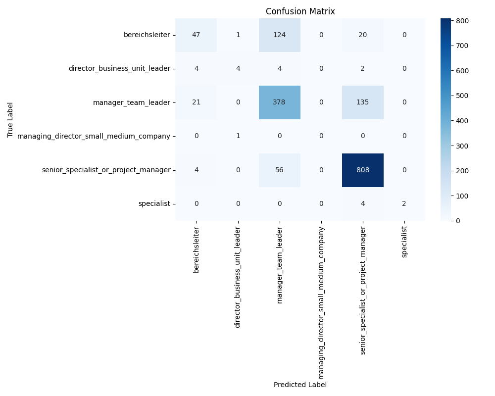

# Career Level Classification

This project implements a machine learning model to classify job positions into different career levels based on job descriptions and other features.

## Result




## Installation

1. Clone the repository:
```bash
git clone <repository-url>
cd career-level-ml
```

2. Create a virtual environment (optional but recommended):
```bash
python -m venv venv
source venv/bin/activate  # On Windows: venv\Scripts\activate
```

3. Install dependencies:
```bash
pip install -r requirements.txt
```

## Model Details

The model uses a pipeline that includes:
1. Text preprocessing using TF-IDF vectorization
2. Feature selection using chi-square test
3. Random Forest classifier

The model is trained using GridSearchCV to find the best hyperparameters.
